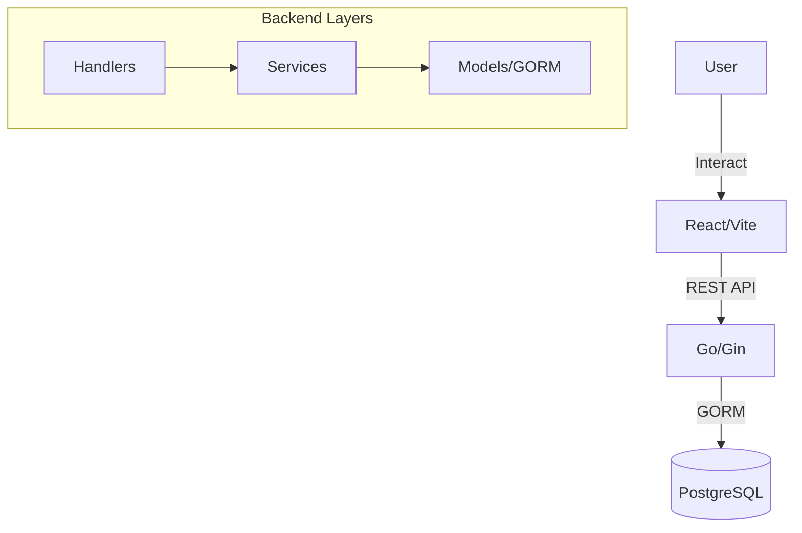

# Homelab Builder - Technical Description

Homelab Builder is a comprehensive, interactive web application designed to simplify the process of planning and architecting home laboratory infrastructure. It provides users with a visual interface to design network topologies, receive intelligent hardware recommendations based on their self-hosting needs, and generate actionable shopping lists and setup guides.

## 🚀 Key Features

### 1. Visual Network Builder
The core of the application is a visual canvas powered by **ReactFlow**. Users can:
- **Drag-and-drop hardware nodes**: Routers, switches, servers, NAS, Mini-PCs, SBCs (like Raspberry Pi), UPS, and more.
- **Wire components**: Graph-based representation of physical and logical connections (Ethernet, etc.).
- **Nested Virtualization**: Define Virtual Machines (VMs), Containers, or LXCs directly on compute nodes (Servers, NAS, etc.).
- **Real-time Synchronization**: The visual state is continuously synchronized with a relational database, allowing for persistent and complex project management.

### 2. Automated IP Management (IPAM)
A sophisticated backend algorithm manages network addressing:
- **Topology-Aware BFS**: Automatically assigns IP addresses by performing a Breadth-First Search from the gateway (Router) through the network graph.
- **Subnet Reservation**: Supports fixed IP offset blocks based on device roles (e.g., Servers get `.150-.159`, Routers get `.1`).
- **Conflict Prevention**: Shared offset maps prevent IP collisions within the same subnet, even in multi-router environments.
- **VM IP Allocation**: Automatically reserves host IPs and assigns incrementing addresses to nested virtual machines.

### 3. Service Catalog & Hardware Recommendations
- **Comprehensive Catalog**: Browse 15+ popular homelab services (Plex, Jellyfin, Home Assistant, Nextcloud, etc.) with pre-defined resource requirements (RAM, CPU, Storage).
- **3-Tier Suggestions**: Generates "Minimal", "Recommended", and "Optimal" hardware profiles tailored to the user's selected services.
- **Resource Summation**: Calculates aggregate resource needs to ensure suggested hardware can handle the concurrent load.

### 4. Live Resource Usage Dashboard
A real-time simulation layer that provides feedback on the designed infrastructure:
- **Capacity Monitoring**: Visualizes total vs. used CPU cores, RAM, and Storage across all compute nodes.
- **Over-provisioning Alerts**: Highlights nodes that are exceeding their physical capacity based on deployed VMs and services.
- **Dynamic Feedback**: Updates instantly as users add/remove hardware or services in the builder.

### 5. Actionable Shopping List & Setup Guide
- **Itemized Components**: Automatically generates a shopping list including the main hardware and necessary peripherals.
- **Price Estimation**: Provides estimated costs in PLN/EUR with direct links to retailers.
- **Dynamic Checklists**: Generates a post-purchase setup guide (e.g., "Install OS", "Configure Docker") based on the selected hardware and services.

---

## 🛠️ Technology Stack

### Frontend
- **Framework**: React 18 with Vite
- **Language**: TypeScript
- **Visuals**: ReactFlow (Graph/Canvas), TailwindCSS (Styling), Lucide-React (Icons)
- **State Management**: Zustand
- **Data Fetching**: TanStack Query (React Query) + Axios

### Backend
- **Language**: Go 1.24+
- **Framework**: Gin Gonic (HTTP Web Framework)
- **Database (ORM)**: GORM v1.25.x
- **Authentication**: Google OAuth 2.0 + JWT (JSON Web Tokens)
- **Security**: Argon2 (if local auth used), Rate Limiting, Security Headers

### Infrastructure & Database
- **Primary Database**: PostgreSQL 15 (utilizing `JSONB` for flexible data and `uuid-ossp` for primary keys)
- **DevOps**: Docker & Docker Compose
- **Web Server**: Nginx (Reverse Proxy)

---

## 🏗️ Technical Architecture

### Data Flow

### Domain Layers
1. **Handlers**: Handle HTTP request parsing, authentication extraction, and response formatting (JSON).
2. **Services**: Contain the core business logic, including the IP assignment algorithm, recommendation engine, and hardware management.
3. **Models**: Centralized GORM definitions in a single source of truth, ensuring consistency across SQL migrations and application logic.

### Database Schema Highlights
- **Builds**: Stores the visual state (JSONB) and relational links to nodes/edges.
- **Nodes/Edges**: Normalized representation of the network graph for efficient traversal and querying.
- **Service Requirements**: Defines the "cost" of running specific software.

---

## 🛡️ Administrative & Community Features
- **Admin Dashboard**: Analytics on user activity, service popularity, and hardware trends.
- **Community Submissions**: Users can submit new services or hardware components for approval to be included in the global catalog.
- **Hardware Reviews**: A built-in system for rating and reviewing specific hardware models (e.g., "Beelink S12 Pro") within the context of homelab performance.
